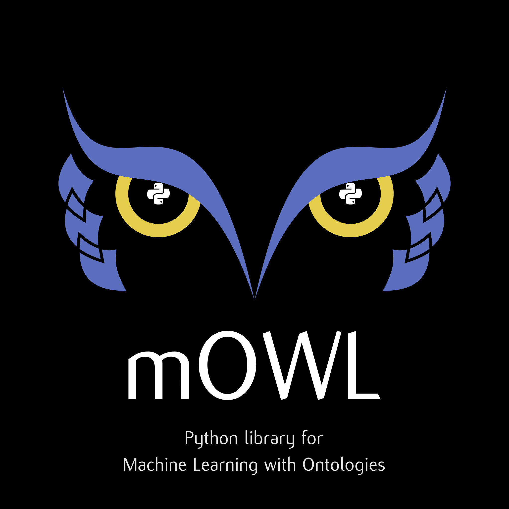

{ width=50% }

# Machine Learning with Ontologies
## Library and tool for machine learning with OWL ontologies


### Development Setup

```
conda env create -f environment.yml
conda activate mowl

mkdir -p ../data

cd mowl
./rebuild.sh

```
