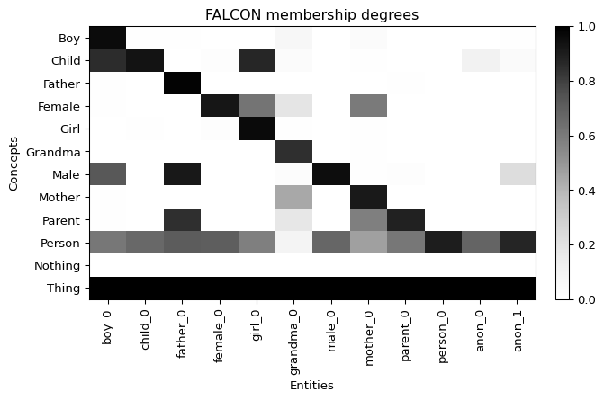

Embedding the ALC language
============================================
.. |alc| replace:: :math:`\mathcal{ALC}`

The :math:`\mathcal{ALC}` description logic extends :math:`\mathcal{EL}` with
negation, disjunction and universal restrictions. mOWL provides
:class:`FALCON <mowl.models.FALCONModel>` [falcon2022]_, a fuzzy-:math:`\mathcal{ALC}`
neural reasoner: every class expression is interpreted as a *fuzzy set* over a
collection of named and sampled anonymous entities, and axioms are scored through
fuzzy logical operators. The training objective combines a TBox term and two ABox
terms (concept and relation assertions), weighted by ``alpha`` and ``beta``
(:math:`\mathcal{L} = \alpha\,\mathcal{L}_T + \beta\,\mathcal{L}_{A_1} +
(1-\alpha-\beta)\,\mathcal{L}_{A_2}`).

Reproducing the Family experiment
---------------------------------

We reproduce Figure 1 of the FALCON paper. We build a small family ontology — a
class hierarchy (``SubClassOf``), defining intersections (e.g.
``Parent ⊓ Male ⊑ Father``), disjointness axioms, and one individual asserted per
concept — and train FALCON on it.

.. testcode::

   from java.util import HashSet
   from mowl.datasets import Dataset
   from mowl.models import FALCONModel
   from mowl.owlapi.adapter import OWLAPIAdapter

   adapter = OWLAPIAdapter()
   ontology = adapter.create_ontology("http://mowl/family")
   cls = lambda name: adapter.create_class("http://" + name)

   concepts = ["Male", "Female", "Parent", "Child", "Person",
               "Father", "Mother", "Boy", "Girl", "Grandma"]
   c = {name: cls(name) for name in concepts}
   axioms = HashSet()

   for sub, sup in [("Male", "Person"), ("Female", "Person"), ("Parent", "Person"),
                    ("Child", "Person"), ("Father", "Male"), ("Father", "Parent"),
                    ("Mother", "Female"), ("Mother", "Parent"), ("Boy", "Male"),
                    ("Boy", "Child"), ("Girl", "Female"), ("Girl", "Child"),
                    ("Grandma", "Mother")]:
       axioms.add(adapter.create_subclass_of(c[sub], c[sup]))

   for (left, right), target in [(("Parent", "Male"), "Father"),
                                 (("Parent", "Female"), "Mother"),
                                 (("Child", "Male"), "Boy"),
                                 (("Child", "Female"), "Girl")]:
       axioms.add(adapter.create_subclass_of(
           adapter.create_object_intersection_of(c[left], c[right]), c[target]))

   for a, b in [("Male", "Female"), ("Parent", "Child"),
                ("Boy", "Girl"), ("Father", "Mother")]:
       axioms.add(adapter.create_disjoint_classes(c[a], c[b]))

   for name in concepts:
       individual = adapter.create_individual("http://" + name.lower() + "_0")
       axioms.add(adapter.create_class_assertion(c[name], individual))

   adapter.owl_manager.addAxioms(ontology, axioms)
   dataset = Dataset(ontology, validation=ontology, testing=ontology)

   model = FALCONModel(dataset, embed_dim=50, anon_e=4, alpha=0.5, beta=0.5,
                       learning_rate=0.01, num_negs=8)
   model.train(epochs=300, validate_every=100)

The learned fuzzy model can be inspected with
:class:`FALCONVisualizer <mowl.visualization.FALCONVisualizer>`, which computes the
membership degree :math:`\mu(C, e)` of every concept ``C`` over the named individuals
and a number of sampled anonymous entities, and renders it as a heatmap:

.. testcode::

   from mowl.visualization import FALCONVisualizer

   visualizer = FALCONVisualizer(model)
   matrix, concepts, entities = visualizer.membership_matrix(n_anon=2)

   FALCON membership degrees on the Family ontology (dark = membership close to 1).
   Each individual is a member of its asserted concept and of every super-concept
   entailed by the TBox — for example, ``boy_0`` belongs to ``Boy``, ``Child``,
   ``Male`` and ``Person`` — while ``Nothing`` is empty and ``Thing`` is universal.

You can also access the learned embeddings:

.. testcode::

   class_embeddings = model.class_embeddings
   object_property_embeddings = model.object_property_embeddings
