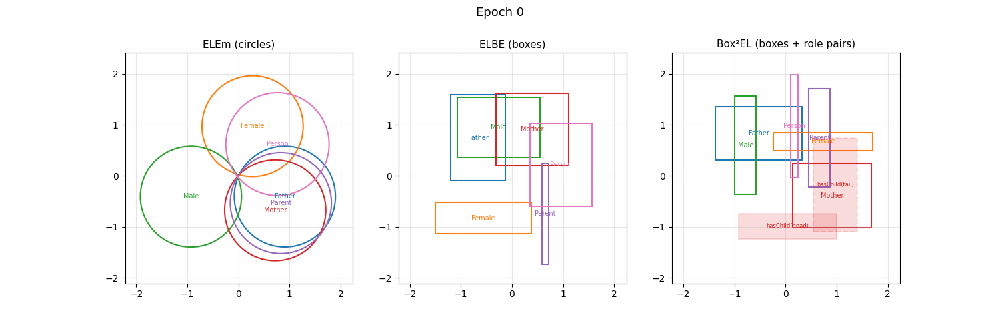

.. DO NOT EDIT.
.. THIS FILE WAS AUTOMATICALLY GENERATED BY SPHINX-GALLERY.
.. TO MAKE CHANGES, EDIT THE SOURCE PYTHON FILE:
.. "examples/elmodels/plot_3_el_geometry.py"
.. LINE NUMBERS ARE GIVEN BELOW.

.. only:: html

    .. note::
        :class: sphx-glr-download-link-note

        :ref:`Go to the end <sphx_glr_download_examples_elmodels_plot_3_el_geometry.py>`
        to download the full example code.

.. rst-class:: sphx-glr-example-title

.. _sphx_glr_examples_elmodels_plot_3_el_geometry.py:

Geometric EL Embeddings: Training Animation
===========================================

All three geometric EL models embed ontology classes as 2-D shapes when
trained with ``embed_dim=2``, letting us watch the geometry evolve directly —
no dimensionality reduction needed.

* **ELEm** — classes as *circles* (centre ``class_embed``, radius ``class_rad``)
* **ELBE** — classes as *axis-aligned rectangles* (centre ``class_embed``, half-extents ``class_offset``)
* **Box²EL** — classes as *axis-aligned rectangles* (centre ``class_center``, half-extents ``class_offset``);
  roles as *pairs of boxes* — head box (solid, soft fill) and tail box (dashed, soft fill)

This example trains all three models on the Family ontology and produces an
interactive animation showing how the shapes evolve across epochs.

.. GENERATED FROM PYTHON SOURCE LINES 19-21

Imports and JVM initialisation
------------------------------

.. GENERATED FROM PYTHON SOURCE LINES 21-38

.. code-block:: Python

    import mowl
    mowl.init_jvm("10g")

    import matplotlib
    matplotlib.use("Agg")
    import matplotlib.pyplot as plt
    import matplotlib.patches as mpatches
    import matplotlib.animation as animation
    import numpy as np
    import torch as th
    from IPython.display import HTML

    from mowl.datasets.builtin import FamilyDataset
    from mowl.models import ELEmbeddings, ELBE, BoxSquaredEL
    from mowl.visualization.el.base import _local_name

.. GENERATED FROM PYTHON SOURCE LINES 39-41

Dataset and entity selection
----------------------------

.. GENERATED FROM PYTHON SOURCE LINES 41-44

.. code-block:: Python

    dataset = FamilyDataset()

.. GENERATED FROM PYTHON SOURCE LINES 45-47

Training parameters
-------------------

.. GENERATED FROM PYTHON SOURCE LINES 47-52

.. code-block:: Python

    EPOCHS = 100
    SNAPSHOT_EVERY = 5
    N_CLASSES = 6

.. GENERATED FROM PYTHON SOURCE LINES 53-56

Snapshot helpers
----------------
We store raw numpy arrays per snapshot and recreate patches at animation time.

.. GENERATED FROM PYTHON SOURCE LINES 56-103

.. code-block:: Python

    def _indices(model, n):
        items = list(model.class_index_dict.items())[:n]
        iris = [iri for iri, _ in items]
        idxs = th.tensor([idx for _, idx in items])
        return iris, idxs

    def _role_indices(model):
        items = list(model.object_property_index_dict.items())
        iris = [iri for iri, _ in items]
        idxs = th.tensor([idx for _, idx in items])
        return iris, idxs

    def _elem_snapshot(model, idxs):
        with th.no_grad():
            centers = model.module.class_embed.weight[idxs].cpu().numpy()
            radii   = np.abs(model.module.class_rad.weight[idxs].cpu().numpy())
        return centers, radii

    def _box_snapshot_elbe(model, idxs):
        with th.no_grad():
            centers = model.module.class_embed.weight[idxs].cpu().numpy()
            halves  = np.abs(model.module.class_offset.weight[idxs].cpu().numpy())
        return centers, halves

    def _box_snapshot_box2(model, class_idxs, role_idxs):
        with th.no_grad():
            centers    = model.module.class_center.weight[class_idxs].cpu().numpy()
            halves     = np.abs(model.module.class_offset.weight[class_idxs].cpu().numpy())
            head_cs    = model.module.head_center.weight[role_idxs].cpu().numpy()
            head_hs    = np.abs(model.module.head_offset.weight[role_idxs].cpu().numpy())
            tail_cs    = model.module.tail_center.weight[role_idxs].cpu().numpy()
            tail_hs    = np.abs(model.module.tail_offset.weight[role_idxs].cpu().numpy())
        return centers, halves, head_cs, head_hs, tail_cs, tail_hs

    def make_callback(snapshots, getter, *getter_args):
        def callback(epoch, model):
            if epoch % SNAPSHOT_EVERY == 0:
                snapshots.append(getter(model, *getter_args))
        return callback

.. GENERATED FROM PYTHON SOURCE LINES 104-106

Train ELEm
----------

.. GENERATED FROM PYTHON SOURCE LINES 106-115

.. code-block:: Python

    elem_model = ELEmbeddings(dataset, embed_dim=2, learning_rate=0.01, margin=-0.1)
    iris, idxs = _indices(elem_model, N_CLASSES)
    labels = [_local_name(iri) for iri in iris]

    elem_snapshots = []
    elem_model.train(epochs=EPOCHS,
                     epoch_callback=make_callback(elem_snapshots, _elem_snapshot, idxs))

.. rst-class:: sphx-glr-script-out

 .. code-block:: none

    You are using the default training method. If you want to use a customized training method (e.g., different negative sampling, etc.), please override the appropriate methods in a subclass.
    Training datasets: 
            gci0: 7
            gci1: 2
            gci2: 1
            gci3: 1
            gci0_bot: 0
            gci1_bot: 1
            gci3_bot: 0


      0%|          | 0/100 [00:00<?, ?it/s]Epoch 1: Train loss: 9.036277770996094
    Epoch 2: Train loss: 8.516671180725098
    Epoch 3: Train loss: 7.542446136474609
    Epoch 4: Train loss: 8.601715087890625
    Epoch 5: Train loss: 8.085187911987305
    Epoch 6: Train loss: 8.245832443237305
    Epoch 7: Train loss: 8.090076446533203
    Epoch 8: Train loss: 7.975215435028076
    Epoch 9: Train loss: 7.779609680175781
    Epoch 10: Train loss: 6.371455669403076
    Epoch 11: Train loss: 7.202725887298584
    Epoch 12: Train loss: 7.391547203063965
    Epoch 13: Train loss: 7.201756954193115
    Epoch 14: Train loss: 7.104437351226807
    Epoch 15: Train loss: 6.828982353210449
    Epoch 16: Train loss: 6.307655334472656
    Epoch 17: Train loss: 5.316465377807617
    Epoch 18: Train loss: 6.394965648651123
    Epoch 19: Train loss: 5.016437530517578
    Epoch 20: Train loss: 4.896455764770508
    Epoch 21: Train loss: 4.784360885620117
    Epoch 22: Train loss: 5.916054725646973
    Epoch 23: Train loss: 5.801900863647461
    Epoch 24: Train loss: 5.821107864379883
    Epoch 25: Train loss: 5.084361553192139
    Epoch 26: Train loss: 4.236297607421875
    Epoch 27: Train loss: 5.455195903778076
    Epoch 28: Train loss: 4.716122150421143
    Epoch 29: Train loss: 5.1995320320129395
    Epoch 30: Train loss: 3.812298536300659
    Epoch 31: Train loss: 4.911078453063965
    Epoch 32: Train loss: 3.928922414779663
    Epoch 33: Train loss: 3.907646656036377
    Epoch 34: Train loss: 3.836376667022705
    Epoch 35: Train loss: 3.685602903366089
    Epoch 36: Train loss: 3.6040661334991455
    Epoch 37: Train loss: 4.384804725646973
    Epoch 38: Train loss: 4.155163288116455
    Epoch 39: Train loss: 4.076224327087402
    Epoch 40: Train loss: 3.9803881645202637
    Epoch 41: Train loss: 4.161637306213379
    Epoch 42: Train loss: 3.327418088912964
    Epoch 43: Train loss: 4.028378009796143
    Epoch 44: Train loss: 3.1217410564422607
    Epoch 45: Train loss: 3.2708990573883057
    Epoch 46: Train loss: 3.4508121013641357

     46%|████▌     | 46/100 [00:00<00:00, 452.71it/s]Epoch 47: Train loss: 3.7347702980041504
    Epoch 48: Train loss: 3.857001543045044
    Epoch 49: Train loss: 2.3973844051361084
    Epoch 50: Train loss: 3.1116280555725098
    Epoch 51: Train loss: 2.6647751331329346
    Epoch 52: Train loss: 2.610853910446167
    Epoch 53: Train loss: 3.2612195014953613
    Epoch 54: Train loss: 3.1715564727783203
    Epoch 55: Train loss: 2.7133750915527344
    Epoch 56: Train loss: 3.2585761547088623
    Epoch 57: Train loss: 2.684542655944824
    Epoch 58: Train loss: 2.6366963386535645
    Epoch 59: Train loss: 2.3615975379943848
    Epoch 60: Train loss: 1.6740601062774658
    Epoch 61: Train loss: 2.200753927230835
    Epoch 62: Train loss: 1.9934539794921875
    Epoch 63: Train loss: 1.9169942140579224
    Epoch 64: Train loss: 1.8674886226654053
    Epoch 65: Train loss: 2.539564609527588
    Epoch 66: Train loss: 2.448906898498535
    Epoch 67: Train loss: 1.8799827098846436
    Epoch 68: Train loss: 1.7776453495025635
    Epoch 69: Train loss: 1.559741497039795
    Epoch 70: Train loss: 1.5643357038497925
    Epoch 71: Train loss: 1.3869588375091553
    Epoch 72: Train loss: 1.3549718856811523
    Epoch 73: Train loss: 1.3623371124267578
    Epoch 74: Train loss: 1.4262572526931763
    Epoch 75: Train loss: 1.1728299856185913
    Epoch 76: Train loss: 2.08278751373291
    Epoch 77: Train loss: 1.361546277999878
    Epoch 78: Train loss: 1.7683393955230713
    Epoch 79: Train loss: 1.117954134941101
    Epoch 80: Train loss: 0.9636088013648987
    Epoch 81: Train loss: 0.8206977248191833
    Epoch 82: Train loss: 0.8818691372871399
    Epoch 83: Train loss: 0.8393010497093201
    Epoch 84: Train loss: 1.3967581987380981
    Epoch 85: Train loss: 1.9702485799789429
    Epoch 86: Train loss: 0.9208002090454102
    Epoch 87: Train loss: 1.1412522792816162
    Epoch 88: Train loss: 0.7082206010818481
    Epoch 89: Train loss: 1.4139387607574463
    Epoch 90: Train loss: 0.6769304275512695
    Epoch 91: Train loss: 1.861215591430664
    Epoch 92: Train loss: 1.8415062427520752

     92%|█████████▏| 92/100 [00:00<00:00, 430.28it/s]Epoch 93: Train loss: 1.2901086807250977
    Epoch 94: Train loss: 0.6147353053092957
    Epoch 95: Train loss: 0.5984658002853394
    Epoch 96: Train loss: 1.758795976638794
    Epoch 97: Train loss: 0.7076572179794312
    Epoch 98: Train loss: 0.5603379607200623
    Epoch 99: Train loss: 0.5486326217651367
    Epoch 100: Train loss: 0.5361878871917725

    100%|██████████| 100/100 [00:00<00:00, 434.68it/s]

.. GENERATED FROM PYTHON SOURCE LINES 116-118

Train ELBE
----------

.. GENERATED FROM PYTHON SOURCE LINES 118-124

.. code-block:: Python

    elbe_model = ELBE(dataset, embed_dim=2, learning_rate=0.01, margin=-0.1)
    elbe_snapshots = []
    elbe_model.train(epochs=EPOCHS,
                     epoch_callback=make_callback(elbe_snapshots, _box_snapshot_elbe, idxs))

.. rst-class:: sphx-glr-script-out

 .. code-block:: none

    You are using the default training method. If you want to use a customized training method (e.g., different negative sampling, etc.), please override the appropriate methods in a subclass.
    Training datasets: 
            gci0: 7
            gci1: 2
            gci2: 1
            gci3: 1
            gci0_bot: 0
            gci1_bot: 1
            gci3_bot: 0


      0%|          | 0/100 [00:00<?, ?it/s]Epoch 1: Train loss: 6.1163554191589355
    Epoch 2: Train loss: 4.818540573120117
    Epoch 3: Train loss: 4.378392696380615
    Epoch 4: Train loss: 4.160144329071045
    Epoch 5: Train loss: 3.833900213241577
    Epoch 6: Train loss: 3.476231336593628
    Epoch 7: Train loss: 3.264007806777954
    Epoch 8: Train loss: 3.1064293384552
    Epoch 9: Train loss: 3.6321861743927
    Epoch 10: Train loss: 2.542297124862671
    Epoch 11: Train loss: 3.1913180351257324
    Epoch 12: Train loss: 2.992741823196411
    Epoch 13: Train loss: 2.037827253341675
    Epoch 14: Train loss: 1.8635350465774536
    Epoch 15: Train loss: 2.4837074279785156
    Epoch 16: Train loss: 1.6866450309753418
    Epoch 17: Train loss: 2.2152929306030273
    Epoch 18: Train loss: 1.2968963384628296
    Epoch 19: Train loss: 1.996589183807373
    Epoch 20: Train loss: 1.9026155471801758
    Epoch 21: Train loss: 1.8227851390838623
    Epoch 22: Train loss: 1.7527331113815308
    Epoch 23: Train loss: 1.6906753778457642
    Epoch 24: Train loss: 1.3088597059249878
    Epoch 25: Train loss: 1.5876102447509766
    Epoch 26: Train loss: 0.6935931444168091
    Epoch 27: Train loss: 0.8599743247032166
    Epoch 28: Train loss: 0.8169652819633484
    Epoch 29: Train loss: 0.5677766799926758
    Epoch 30: Train loss: 1.4105976819992065
    Epoch 31: Train loss: 1.3850220441818237
    Epoch 32: Train loss: 1.2745888233184814
    Epoch 33: Train loss: 1.3424116373062134
    Epoch 34: Train loss: 1.294314980506897
    Epoch 35: Train loss: 0.5272194147109985
    Epoch 36: Train loss: 1.2962236404418945
    Epoch 37: Train loss: 0.4802941083908081
    Epoch 38: Train loss: 0.4822816848754883

     38%|███▊      | 38/100 [00:00<00:00, 374.06it/s]Epoch 39: Train loss: 1.258382797241211
    Epoch 40: Train loss: 0.9509890675544739
    Epoch 41: Train loss: 1.2364389896392822
    Epoch 42: Train loss: 0.3746367394924164
    Epoch 43: Train loss: 0.3490767180919647
    Epoch 44: Train loss: 0.32255956530570984
    Epoch 45: Train loss: 0.3191148042678833
    Epoch 46: Train loss: 0.662663459777832
    Epoch 47: Train loss: 0.9398892521858215
    Epoch 48: Train loss: 0.2422861009836197
    Epoch 49: Train loss: 0.25816744565963745
    Epoch 50: Train loss: 0.2089899629354477
    Epoch 51: Train loss: 0.8175129890441895
    Epoch 52: Train loss: 0.8677979707717896
    Epoch 53: Train loss: 0.1773880422115326
    Epoch 54: Train loss: 0.7184770703315735
    Epoch 55: Train loss: 1.1662321090698242
    Epoch 56: Train loss: 0.1924859881401062
    Epoch 57: Train loss: 0.6375314593315125
    Epoch 58: Train loss: 0.3226143419742584
    Epoch 59: Train loss: 0.7213742733001709
    Epoch 60: Train loss: 1.1693083047866821
    Epoch 61: Train loss: 0.29507070779800415
    Epoch 62: Train loss: 0.2042011171579361
    Epoch 63: Train loss: 0.16643914580345154
    Epoch 64: Train loss: 0.19662517309188843
    Epoch 65: Train loss: 0.1903967559337616
    Epoch 66: Train loss: 0.6798498630523682
    Epoch 67: Train loss: 0.15372082591056824
    Epoch 68: Train loss: 0.17038053274154663
    Epoch 69: Train loss: 0.6640154719352722
    Epoch 70: Train loss: 0.22808538377285004
    Epoch 71: Train loss: 0.1679539978504181
    Epoch 72: Train loss: 1.1354528665542603
    Epoch 73: Train loss: 0.5881217122077942
    Epoch 74: Train loss: 1.1280626058578491
    Epoch 75: Train loss: 1.1244086027145386
    Epoch 76: Train loss: 1.1200063228607178
    Epoch 77: Train loss: 0.17618867754936218

     77%|███████▋  | 77/100 [00:00<00:00, 381.33it/s]Epoch 78: Train loss: 0.11475104838609695
    Epoch 79: Train loss: 0.585637629032135
    Epoch 80: Train loss: 0.15460169315338135
    Epoch 81: Train loss: 0.604798436164856
    Epoch 82: Train loss: 1.096428632736206
    Epoch 83: Train loss: 0.587928056716919
    Epoch 84: Train loss: 0.09420279413461685
    Epoch 85: Train loss: 0.12690910696983337
    Epoch 86: Train loss: 0.5817366242408752
    Epoch 87: Train loss: 1.085211157798767
    Epoch 88: Train loss: 1.0838086605072021
    Epoch 89: Train loss: 0.08186172693967819
    Epoch 90: Train loss: 1.0793942213058472
    Epoch 91: Train loss: 0.10787619650363922
    Epoch 92: Train loss: 0.10390126705169678
    Epoch 93: Train loss: 0.07150579243898392
    Epoch 94: Train loss: 0.08656767755746841
    Epoch 95: Train loss: 0.09013766795396805
    Epoch 96: Train loss: 0.594939649105072
    Epoch 97: Train loss: 1.0601743459701538
    Epoch 98: Train loss: 0.582451343536377
    Epoch 99: Train loss: 0.05810125544667244
    Epoch 100: Train loss: 0.5570572018623352

    100%|██████████| 100/100 [00:00<00:00, 384.49it/s]

.. GENERATED FROM PYTHON SOURCE LINES 125-127

Train Box²EL
------------

.. GENERATED FROM PYTHON SOURCE LINES 127-136

.. code-block:: Python

    box2_model = BoxSquaredEL(dataset, embed_dim=2, learning_rate=0.01, margin=-0.1)
    role_iris, role_idxs = _role_indices(box2_model)
    role_labels = [_local_name(iri) for iri in role_iris]

    box2_snapshots = []
    box2_model.train(epochs=EPOCHS,
                     epoch_callback=make_callback(box2_snapshots, _box_snapshot_box2, idxs, role_idxs))

.. rst-class:: sphx-glr-script-out

 .. code-block:: none

    You are using the default training method. If you want to use a customized training method (e.g., different negative sampling, etc.), please override the appropriate methods in a subclass.
    Training datasets: 
            gci0: 7
            gci1: 2
            gci2: 1
            gci3: 1
            gci0_bot: 0
            gci1_bot: 1
            gci3_bot: 0


      0%|          | 0/100 [00:00<?, ?it/s]Epoch 1: Train loss: 14.75809097290039
    Epoch 2: Train loss: 18.519384384155273
    Epoch 3: Train loss: 17.875825881958008
    Epoch 4: Train loss: 18.893587112426758
    Epoch 5: Train loss: 21.128576278686523
    Epoch 6: Train loss: 17.684640884399414
    Epoch 7: Train loss: 14.226886749267578
    Epoch 8: Train loss: 19.615129470825195
    Epoch 9: Train loss: 16.65327262878418
    Epoch 10: Train loss: 18.71095848083496
    Epoch 11: Train loss: 14.693991661071777
    Epoch 12: Train loss: 14.111540794372559
    Epoch 13: Train loss: 15.199738502502441
    Epoch 14: Train loss: 14.844624519348145
    Epoch 15: Train loss: 14.422279357910156
    Epoch 16: Train loss: 14.035082817077637
    Epoch 17: Train loss: 13.627090454101562
    Epoch 18: Train loss: 11.61565113067627
    Epoch 19: Train loss: 13.371499061584473
    Epoch 20: Train loss: 12.511571884155273
    Epoch 21: Train loss: 11.079695701599121
    Epoch 22: Train loss: 12.174832344055176
    Epoch 23: Train loss: 11.843453407287598
    Epoch 24: Train loss: 11.043095588684082
    Epoch 25: Train loss: 11.655438423156738
    Epoch 26: Train loss: 11.028154373168945
    Epoch 27: Train loss: 10.795459747314453
    Epoch 28: Train loss: 10.696592330932617
    Epoch 29: Train loss: 10.308018684387207
    Epoch 30: Train loss: 13.115952491760254

     30%|███       | 30/100 [00:00<00:00, 294.63it/s]Epoch 31: Train loss: 9.89018440246582
    Epoch 32: Train loss: 11.003161430358887
    Epoch 33: Train loss: 9.669988632202148
    Epoch 34: Train loss: 10.650158882141113
    Epoch 35: Train loss: 10.039942741394043
    Epoch 36: Train loss: 9.066719055175781
    Epoch 37: Train loss: 8.478084564208984
    Epoch 38: Train loss: 8.760112762451172
    Epoch 39: Train loss: 9.528585433959961
    Epoch 40: Train loss: 8.274301528930664
    Epoch 41: Train loss: 9.268437385559082
    Epoch 42: Train loss: 8.232233047485352
    Epoch 43: Train loss: 9.012188911437988
    Epoch 44: Train loss: 9.135953903198242
    Epoch 45: Train loss: 8.742538452148438
    Epoch 46: Train loss: 11.11963939666748
    Epoch 47: Train loss: 7.290607452392578
    Epoch 48: Train loss: 7.1766204833984375
    Epoch 49: Train loss: 7.0351104736328125
    Epoch 50: Train loss: 7.432519435882568
    Epoch 51: Train loss: 7.315847396850586
    Epoch 52: Train loss: 7.8061089515686035
    Epoch 53: Train loss: 7.881531715393066
    Epoch 54: Train loss: 8.415884971618652
    Epoch 55: Train loss: 7.469669342041016
    Epoch 56: Train loss: 8.224080085754395
    Epoch 57: Train loss: 6.931191921234131
    Epoch 58: Train loss: 7.2668776512146
    Epoch 59: Train loss: 6.663742542266846
    Epoch 60: Train loss: 6.951622009277344

     60%|██████    | 60/100 [00:00<00:00, 286.27it/s]Epoch 61: Train loss: 6.8525261878967285
    Epoch 62: Train loss: 6.482205867767334
    Epoch 63: Train loss: 6.594752788543701
    Epoch 64: Train loss: 5.784122943878174
    Epoch 65: Train loss: 6.754120349884033
    Epoch 66: Train loss: 5.7967610359191895
    Epoch 67: Train loss: 6.670151710510254
    Epoch 68: Train loss: 6.216248035430908
    Epoch 69: Train loss: 7.7575554847717285
    Epoch 70: Train loss: 7.7239298820495605
    Epoch 71: Train loss: 7.6730241775512695
    Epoch 72: Train loss: 6.045413970947266
    Epoch 73: Train loss: 7.557487964630127
    Epoch 74: Train loss: 5.9525651931762695
    Epoch 75: Train loss: 5.430681228637695
    Epoch 76: Train loss: 5.334909439086914
    Epoch 77: Train loss: 5.287160873413086
    Epoch 78: Train loss: 5.96598482131958
    Epoch 79: Train loss: 5.1834001541137695
    Epoch 80: Train loss: 7.238590717315674
    Epoch 81: Train loss: 7.950783729553223
    Epoch 82: Train loss: 7.211309909820557
    Epoch 83: Train loss: 5.96589469909668
    Epoch 84: Train loss: 5.585473537445068
    Epoch 85: Train loss: 5.892213821411133
    Epoch 86: Train loss: 4.9817328453063965
    Epoch 87: Train loss: 7.613556385040283
    Epoch 88: Train loss: 5.938482761383057
    Epoch 89: Train loss: 7.4506707191467285
    Epoch 90: Train loss: 4.8282341957092285

     90%|█████████ | 90/100 [00:00<00:00, 288.57it/s]Epoch 91: Train loss: 5.624569892883301
    Epoch 92: Train loss: 5.406765937805176
    Epoch 93: Train loss: 4.870469570159912
    Epoch 94: Train loss: 6.9142608642578125
    Epoch 95: Train loss: 5.450855731964111
    Epoch 96: Train loss: 4.625236511230469
    Epoch 97: Train loss: 5.377735614776611
    Epoch 98: Train loss: 4.7161641120910645
    Epoch 99: Train loss: 5.280994415283203
    Epoch 100: Train loss: 5.500998497009277

    100%|██████████| 100/100 [00:00<00:00, 289.52it/s]

.. GENERATED FROM PYTHON SOURCE LINES 137-139

Build and display the animation
--------------------------------

.. GENERATED FROM PYTHON SOURCE LINES 139-237

.. code-block:: Python

    colors = plt.cm.tab10(np.linspace(0, 0.6, N_CLASSES))
    role_colors = plt.cm.Set1(np.linspace(0, 0.5, max(1, len(role_iris))))

    def _axis_limits(all_snaps, pad=0.3):
        """Compute unified axis limits across all models and all snapshots."""
        xs, ys = [], []
        for snaps in all_snaps:
            for snap in snaps:
                centers, sizes = snap[0], snap[1]
                if sizes.shape[1] == 1:
                    r = sizes[:, 0]
                    xs.extend((centers[:, 0] - r).tolist())
                    xs.extend((centers[:, 0] + r).tolist())
                    ys.extend((centers[:, 1] - r).tolist())
                    ys.extend((centers[:, 1] + r).tolist())
                else:
                    xs.extend((centers[:, 0] - sizes[:, 0]).tolist())
                    xs.extend((centers[:, 0] + sizes[:, 0]).tolist())
                    ys.extend((centers[:, 1] - sizes[:, 1]).tolist())
                    ys.extend((centers[:, 1] + sizes[:, 1]).tolist())
                # Box²EL snaps carry role box extents in positions 2-5
                if len(snap) == 6:
                    head_cs, head_hs, tail_cs, tail_hs = snap[2], snap[3], snap[4], snap[5]
                    for cs, hs in [(head_cs, head_hs), (tail_cs, tail_hs)]:
                        xs.extend((cs[:, 0] - hs[:, 0]).tolist())
                        xs.extend((cs[:, 0] + hs[:, 0]).tolist())
                        ys.extend((cs[:, 1] - hs[:, 1]).tolist())
                        ys.extend((cs[:, 1] + hs[:, 1]).tolist())
        return min(xs) - pad, max(xs) + pad, min(ys) - pad, max(ys) + pad

    xmin, xmax, ymin, ymax = _axis_limits([elem_snapshots, elbe_snapshots, box2_snapshots])

    fig, axes = plt.subplots(1, 3, figsize=(15, 5))
    model_titles = ["ELEm (circles)", "ELBE (boxes)", "Box²EL (boxes + role pairs)"]
    all_snaps = [elem_snapshots, elbe_snapshots, box2_snapshots]

    def draw_frame(frame_idx):
        for ax, snaps, title in zip(axes, all_snaps, model_titles):
            ax.cla()
            ax.set_title(title, fontsize=11)
            ax.set_xlim(xmin, xmax)
            ax.set_ylim(ymin, ymax)
            ax.set_aspect("equal")
            ax.grid(True, alpha=0.3)

            snap = snaps[frame_idx]
            centers, sizes = snap[0], snap[1]

            # Draw class shapes
            for i, (cx, cy) in enumerate(centers):
                color = colors[i]
                if sizes.shape[1] == 1:
                    r = float(sizes[i, 0])
                    patch = mpatches.Circle((cx, cy), r, fill=False,
                                            edgecolor=color, linewidth=1.5)
                else:
                    hx, hy = float(sizes[i, 0]), float(sizes[i, 1])
                    patch = mpatches.Rectangle(
                        (cx - hx, cy - hy), 2 * hx, 2 * hy,
                        fill=False, edgecolor=color, linewidth=1.5)
                ax.add_patch(patch)
                ax.annotate(labels[i], (cx, cy), ha="center", va="center",
                            fontsize=7, color=color)

            # Draw role boxes for Box²EL: head=solid soft fill, tail=dashed soft fill
            if len(snap) == 6:
                head_cs, head_hs, tail_cs, tail_hs = snap[2], snap[3], snap[4], snap[5]
                for j, rl in enumerate(role_labels):
                    rc = role_colors[j]

                    hcx, hcy = float(head_cs[j, 0]), float(head_cs[j, 1])
                    hhx, hhy = float(head_hs[j, 0]), float(head_hs[j, 1])
                    ax.add_patch(mpatches.Rectangle(
                        (hcx - hhx, hcy - hhy), 2 * hhx, 2 * hhy,
                        fill=True, facecolor=rc, alpha=0.15,
                        edgecolor=rc, linestyle="solid", linewidth=1.5))
                    ax.annotate(f"{rl}(head)", (hcx, hcy), ha="center", va="center",
                                fontsize=6, color=rc)

                    tcx, tcy = float(tail_cs[j, 0]), float(tail_cs[j, 1])
                    thx, thy = float(tail_hs[j, 0]), float(tail_hs[j, 1])
                    ax.add_patch(mpatches.Rectangle(
                        (tcx - thx, tcy - thy), 2 * thx, 2 * thy,
                        fill=True, facecolor=rc, alpha=0.15,
                        edgecolor=rc, linestyle="dashed", linewidth=1.5))
                    ax.annotate(f"{rl}(tail)", (tcx, tcy), ha="center", va="center",
                                fontsize=6, color=rc)

        fig.suptitle(f"Epoch {frame_idx * SNAPSHOT_EVERY}", fontsize=13)

    n_frames = len(elem_snapshots)
    ani = animation.FuncAnimation(fig, draw_frame, frames=n_frames, interval=150)

.. image-sg:: /examples/elmodels/images/sphx_glr_plot_3_el_geometry_001.png
   :alt: plot 3 el geometry
   :srcset: /examples/elmodels/images/sphx_glr_plot_3_el_geometry_001.png
   :class: sphx-glr-single-img

.. GENERATED FROM PYTHON SOURCE LINES 238-241

Save as an animated GIF that autoplays in browsers and docs pages.
When run as a standalone script, the GIF is saved next to the docs images.
In a Sphinx Gallery build the file is pre-committed; __file__ is not available.

.. GENERATED FROM PYTHON SOURCE LINES 241-252

.. code-block:: Python

    try:
        import os as _os
        _gif_path = _os.path.join(
            _os.path.dirname(_os.path.abspath(__file__)),
            "../../docs/source/examples/elmodels/images/el_geometry_training.gif"
        )
        ani.save(_gif_path, writer="pillow", fps=6)
    except NameError:
        pass

.. GENERATED FROM PYTHON SOURCE LINES 253-256

.. rst-class:: sphx-glr-timing

   **Total running time of the script:** (0 minutes 3.930 seconds)

**Estimated memory usage:**  450 MB

.. _sphx_glr_download_examples_elmodels_plot_3_el_geometry.py:

.. only:: html

  .. container:: sphx-glr-footer sphx-glr-footer-example

    .. container:: sphx-glr-download sphx-glr-download-jupyter

      :download:`Download Jupyter notebook: plot_3_el_geometry.ipynb <plot_3_el_geometry.ipynb>`

    .. container:: sphx-glr-download sphx-glr-download-python

      :download:`Download Python source code: plot_3_el_geometry.py <plot_3_el_geometry.py>`

    .. container:: sphx-glr-download sphx-glr-download-zip

      :download:`Download zipped: plot_3_el_geometry.zip <plot_3_el_geometry.zip>`

.. only:: html

 .. rst-class:: sphx-glr-signature

    `Gallery generated by Sphinx-Gallery <https://sphinx-gallery.github.io>`_
