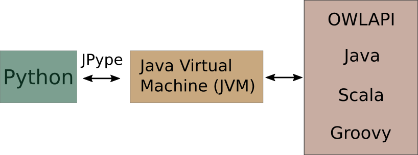

==================================
 Welcome to mOWL's documentation!
==================================

**mOWL** is a Python library for Machine Learning with
Ontologies. Here you can find functionalities to manipulate
ontologies and use them as data for several methods that generate
embeddings of ontology entities.

Background
===========

The development of this library was based on the paper: `Semantic
similarity and machine learning with ontologies
<https://academic.oup.com/bib/article/22/4/bbaa199/5922325>`_. In this
work, several tutorials and slides have been created for users that
are interested on ontologies and machine learning methods. The tutorials can be found as Jupyter notebooks at this `link to the notebooks <https://github.com/bio-ontology-research-group/machine-learning-with-ontologies#notebooks>`_. The slides can be found at this `link to the slides <https://github.com/bio-ontology-research-group/machine-learning-with-ontologies#slides>`_.

Some of those tutorials can be found in mOWL in the :doc:`/examples/index/` section and, eventually, more examples will be available directly in mOWL.

Getting started
===============

**mOWL** can be installed from `source code <https://github.com/bio-ontology-research-group/mowl>`_ or from `PyPi <https://pypi.org/project/mowl-borg/>`_. For more details on installation check out the how to :doc:`install/index` section of the project.

.. note::
   This version of documentation corresponds to mOWL-0.1.1.

mOWL, JPype and the JVM
=============================

mOWL is a Python library. However, it interfaces the OWLAPI, which is written in Java. For that reason, mOWL uses JPype to use the JVM and access Java code from Python scripts.

	   

In order to use mOWL with all its functionalities, the Java Virtual Machine must be started. We can do that in the following way:

.. code:: python

   import mowl
   mowl.init_jvm("2g")

In the above piece of code, we specify the amount of memory given to the JVM. The memory parameter (`2g` in the example) corresponds to the parameter "-Xmx" for the JVM initialization step. For more information about the JVM memory management please follow this `link <https://docs.oracle.com/cd/E13150_01/jrockit_jvm/jrockit/geninfo/diagnos/garbage_collect.html>`_.

.. note::

   The function ``init_jvm`` can only be called once during running time. This means that the JVM cannot be restarted and this is a limitation of JPype as stated in this `section <https://jpype.readthedocs.io/en/latest/api.html#jpype.shutdownJVM>`_ of their documentation.

   
Authors
=======

**mOWL** is a project initiated and developed by the `Bio-Ontology Research Group <https://cemse.kaust.edu.sa/borg>`_ from KAUST.
Furthermore, mOWL had other collaboration by being part of:

* `Biohackathon Europe 2021 <https://2021.biohackathon-europe.org/>`_ as project ``#27``.
* `Biohackathon Europe 2022 <https://biohackathon-europe.org/>`_ as project ``#18``.

License
=======

The package is released under the BSD 3-Clause License.

.. toctree::
   :maxdepth: 1
   :caption: Get Started
   :hidden:
   :glob:

   install/index
   datasets/index
   corpus/index
   ontology/index
   owlapi/index
   graphs/index
   embedding_el/index
   evaluation/index
   visualization/index
   examples/index
   
.. toctree::
   :maxdepth: 1
   :caption: FAQ
   :hidden:
   :glob:

   faq/errors/index
   
.. toctree::
   :maxdepth: 2
   :caption: API reference
   :hidden:
   :glob:

   api/base_models/index
   api/corpus/index
   api/datasets/index
   api/evaluation/index
   api/models/index
   api/nn/index
   api/ontology/index
   api/owlapi/index
   api/projection/index
   api/walking/index
   api/reasoning/index

   api/visualization/index

